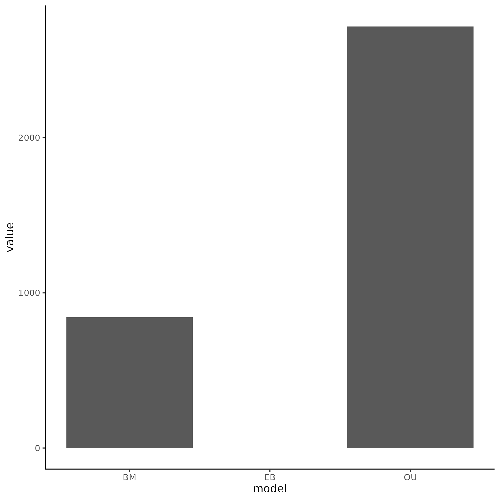
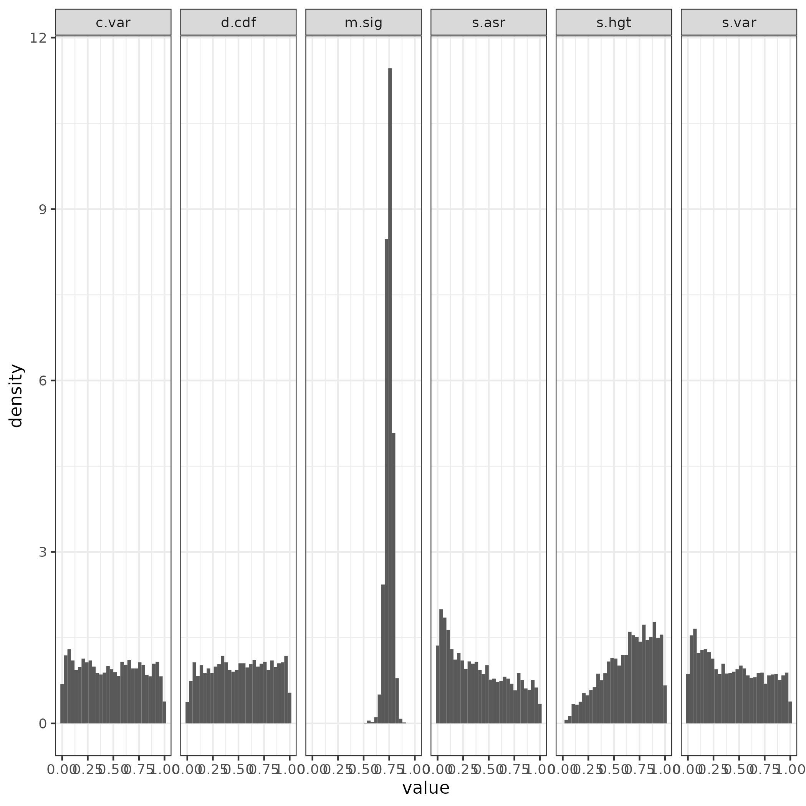

```{r setup, include=FALSE, echo=FALSE}
knitr::opts_chunk$set(echo = TRUE)
library(tidyverse)
```

## Summary of Data Set

The data analyzed in this repository is from a study on the evolution of blindness-related gene expression in a set of cave-dwelling and surface-dwelling crayfish. The original study found that species expression patterns in adult eye cluster more closely by eye function than phylogenetic relationship. However, comparison to surface species shows that this similarity was not greater than that for non-blind crayfish via accounting for phylogenetic expectation. They mention that blind lineages show an increase in evolutionary rate, and that different lineages have unique optima. This suggests that the model of evolution for this group should follow Ornstein-Uhlenbeck with multiple optima as well as multiple evolution rates. So an OUMA or OUMV model should be the most adequate. Failing that, an OU model of evolution should be mostly adequate.

```{r Figure1, echo=FALSE}
pvals <- readRDS("arbutus/best/best_pvals") %>% select(!m.sig)
pvals_mut <- pvals %>%
  transmute(c.less = c.var <= 0.05, sv.less = s.var <= 0.05, sa.less = s.asr <= 0.05,
            sh.less = s.hgt <= 0.05 & !is.na(s.hgt), d.less = d.cdf <= 0.05) %>%
  transmute(inade = c.less + sv.less + sa.less + sh.less + d.less) %>% count(inade) %>%
  mutate(prop = n/sum(n)) %>% mutate(inade = as.character(inade))

pvals_mut %>% ggplot(aes(x = inade, y = n, fill = inade)) + geom_bar(stat = "identity") + 
  xlab("Number of inadequacies") + ylab("Number of genes") +
  ggtitle("Amount of genes by number of inadequacies") + theme_bw()
```

**Figure 1.** Number of genes by number of inadequacies. Most genes were adequate or only had 1 inadequacy.

Overall most genes (65%) showed no inadequacies, with 27% of the genes with inadequacies only having one.

## Methods

I first conducted a relative fit analysis via AIC of three models (EB, OU, BM) and then used the best-fit model to conduct an absolute adequacy test via arbutus.

## Results

Relative fit and absolute adequacy analysis returned the following plots.





**Figure 2.** Relative fit (left) and absolute adequacy (right) of the best fit model to the gene expression data in crayfish eye. OU model was the best fit model out of the three for a majority of the data and was overall adequate, with notable exceptions with s.asr and a small issue with s.asr.

As shown by the figure above, the data was mostly adequate for the model, with an exception for s.asr. This test statistic accounts for trait variation relative to the absolute trait magnitude. It aims to answer the question; do larger values of gene expression also *vary* more? This may show inadequacies when the "true" model may have multiple rate values, but is being coerced to a model with a single rate value. I next wanted to see the relative contribution of each test statistic to overall adequacy of a model.

```{r, echo=FALSE}
test <- pvals %>% drop_na() %>%
  transmute(c.var = c.var <= 0.05, s.var = s.var <= 0.05,
              s.asr = s.asr <= 0.05, s.hgt = s.hgt <= 0.05 & !is.na(s.hgt),
              d.cdf = d.cdf <= 0.05) %>% drop_na() %>% summarise(across(.fns = ~sum(.x, na.rm = TRUE))) 

figure2 <- test %>% pivot_longer(cols = everything(), names_to = "test statistic") %>% 
  ggplot(aes(x = `test statistic`, y = value/sum(value), fill = `test statistic`)) + geom_col() + geom_text(aes(label = round(value/sum(value), digits = 2))) + ylab("Percent of inadequacies") + theme_bw()

figure2
```

**Figure 3.** Relative contribution of each test statistic to inadequacies.

As shown by the figure above, s.asr and c.var are the main contributors to inadequacy of a simple single-optima and single rate OU model. C.var being a significant contributor supports the idea that the inadequacy is due to coercing a multi-rate process to a single rate, as this test statistic is violated during those circumstances as well. This suggests that an OUMV model would be most appropriate for the data.

## Conclusion

Analysis of the data set reveals that an OU model is mostly adequate, but a model with multiple rate (like OUMV) would better capture the variation of the real data.
